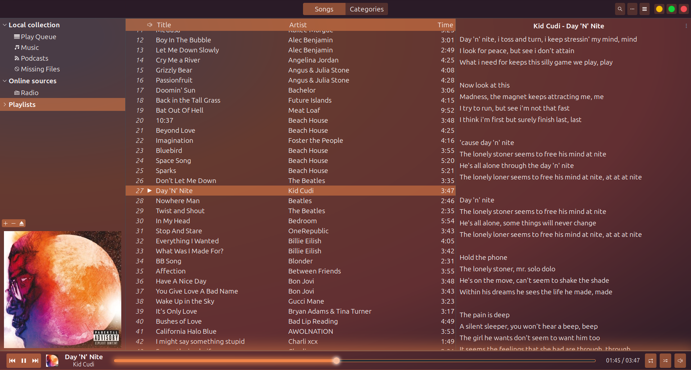
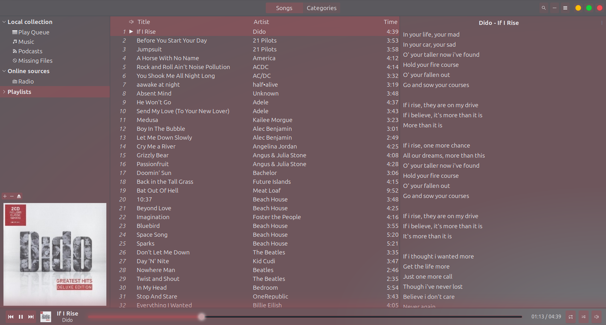
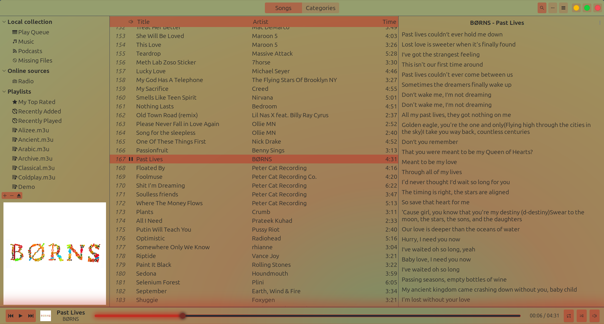
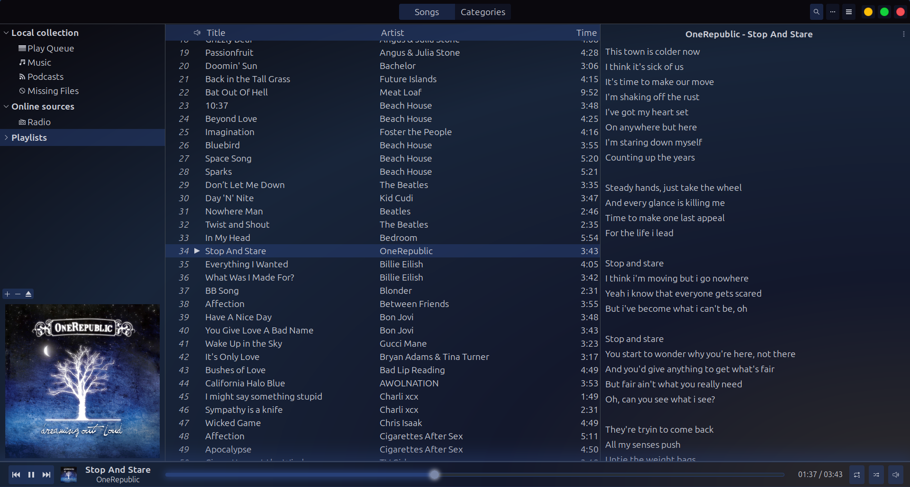
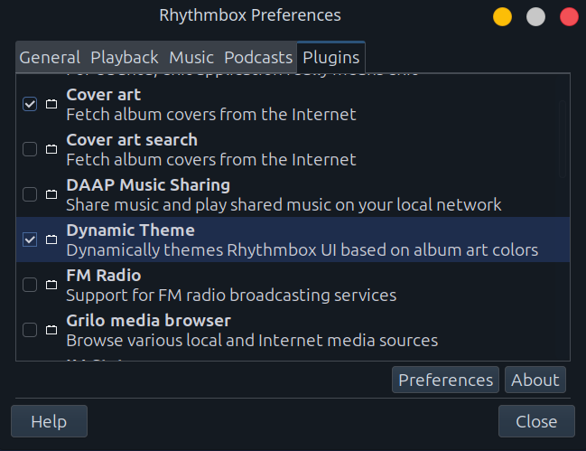
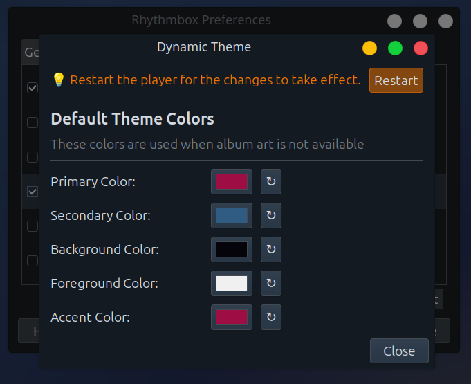

# Rhythmbox Dynamic Theme

Rhythmbox Dynamic Theme automatically themes your Rhythmbox UI based on the album art of the currently playing song.


## Features

- **Automatic Theme Updates** - Theme changes dynamically as songs play
- **Intelligent Color Extraction** - Selects vibrant, contrasting colors from album art
-  **WCAG AA Compliant** - Ensures readable text with 4.5:1 contrast ratio
- **Performance Optimized**
  - Replaces GTK's continuous CSS animation polling with discrete timer-based state cycling, eliminating constant re-rendering overhead and achieving 85-90% CPU reduction compared to traditional `@keyframes` animations
  - Debouncing prevents flickering during rapid song changes
  - LRU cache for instant theme switching on repeated albums
  - Asynchronous color extraction (non-blocking UI)
  - Image resizing before processing
  
- **Graceful Fallback** - Uses beautiful default theme when album art is missing


## Screenshots

<p float="left">
  
  
</p>
<p float="left">
  
  
</p>


## Installation

### 1. Install Dependencies

**Ubuntu/Debian:**
```bash
sudo apt install python3-gi python3-gi-cairo gir1.2-gtk-3.0 python3-pil python3-mutagen
```

**Fedora:**
```bash
sudo dnf install python3-gobject gtk3 python3-pillow python-mutagen
```

**Arch Linux:**
```bash
sudo pacman -S python-gobject gtk3 python-pillow python-mutagen
```

**Other distributions:** If your distribution doesn't package these libraries, install via pip:
```bash
pip3 install --user Pillow mutagen
```

### 2. Install the Plugin

```bash
# Clone the repository
git clone https://github.com/BOTbkcd/rhythmbox-dynamic-theme.git
cd rhythmbox-dynamic-theme

# Remove old installation if it exists
rm -rf ~/.local/share/rhythmbox/plugins/rhythmbox-dynamic-theme

# Install the GSettings schema (overwrites old version if present)
sudo cp org.gnome.rhythmbox.plugins.rhythmbox-dynamic-theme.gschema.xml /usr/share/glib-2.0/schemas/
sudo glib-compile-schemas /usr/share/glib-2.0/schemas/

# Create plugin directory if it doesn't exist
mkdir -p ~/.local/share/rhythmbox/plugins

# Create symlink
ln -s $(pwd) ~/.local/share/rhythmbox/plugins/rhythmbox-dynamic-theme
```

### 3. Enable the Plugin

1. Launch Rhythmbox
2. Go to **Preferences → Plugins**
3. Find **Dynamic Theme** in the plugin list

4. Check the checkbox to enable it
5. (Optional) Configure the default theme colors


The plugin should now be active! Start playing a song with album art to see the theme change.


## Troubleshooting

### Plugin Not Loading

```bash
# Check if plugin directory exists and is correct
ls -la ~/.local/share/rhythmbox/plugins/rhythmbox-dynamic-theme/

# Verify plugin metadata
cat ~/.local/share/rhythmbox/plugins/rhythmbox-dynamic-theme/rhythmbox-dynamic-theme.plugin

# Check Python dependencies
python3 -c "from PIL import Image; print('Pillow OK')"
python3 -c "from mutagen import File; print('Mutagen OK')"
python3 -c "from gi.repository import Gtk; print('GTK OK')"
```

### Theme Not Applying

```bash
# Run with debug output
rhythmbox -D rhythmbox-dynamic-theme

# Check album art exists
ls ~/.cache/rhythmbox/covers/
```

## License

This project is licensed under the GNU General Public License v3.0 - see the [LICENSE](LICENSE) file for details.
